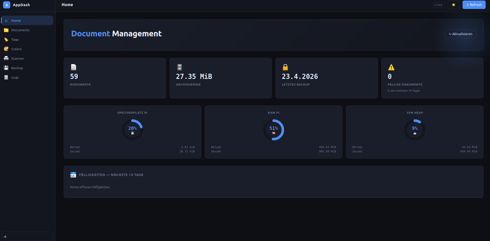
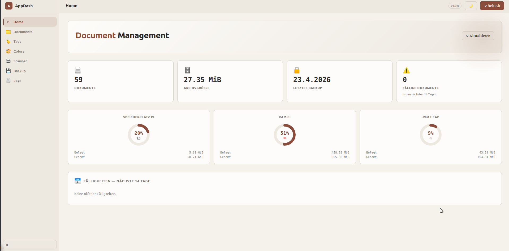
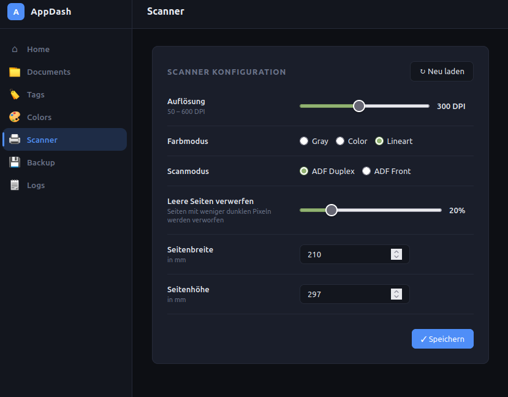
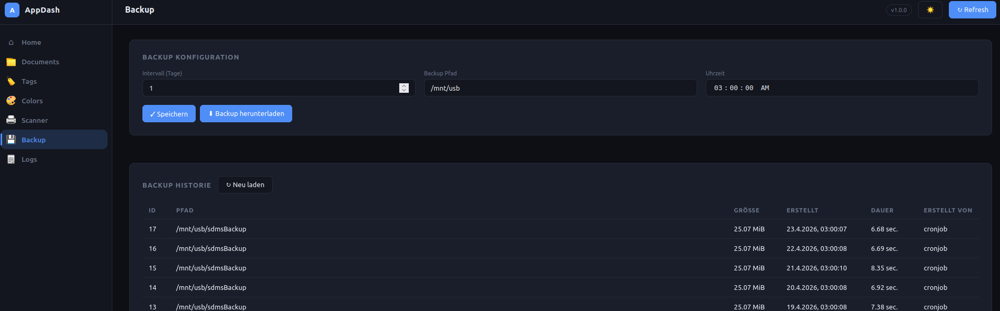
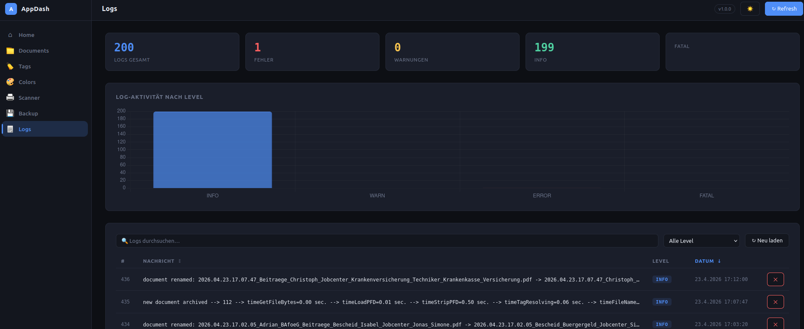

# SDMS — Simple Document Management System

> A self-hosted document management system running on a Raspberry Pi 3B

- Java 8 / Jersey 3
- Vue 3
- MariaDB
- Raspberry Pi

---

## Overview

SDMS is a simple but powerful personal document management system designed for self-hosting on low-power hardware. It automates the full document pipeline — from scanning to storage, OCR, tagging, and backup — with no cloud dependency and no LLM involvement.

The backend runs as a Java/Jersey REST API on port 8080, the frontend is built in Vue 3 (no build tools), and all data is stored in MariaDB. The system is deployed on a Raspberry Pi 3 B+ with a Fujitsu ScanSnap iX500 connected via USB.

---

     

## Features

- **OCR** — Text extraction via Tesseract (German + English); called from a custom scan script
- **Auto-tagging** — OCR text is matched against a configurable tagging system; documents are named and tagged automatically
- **Tag colors & categories** — Tags are grouped into categories with individual color coding
- **Fulltext search** — Search across OCR text and document comments
- **PDF support** — Direct PDF upload with text extraction; scanned pages are converted to compact PDFs via img2pdf
- **Backup system** — Configurable automated backups with mysqldump, tar.gz archiving, SHA-256 verification
- **Cron management** — Backup schedules are managed from the UI via Java ProcessBuilder crontab integration
- **Scanner configuration** — Scanner settings stored in DB and configurable via API
- **Due date reminders** — Reminder system for document deadlines
- **Logging** — Backend logs accessible directly from the frontend; auto-load on page open

---

## Tech Stack

| Layer | Technology |
|---|---|
| Backend | Java 8, Jersey 3, Jackson — REST API on port 8080 |
| Frontend | Vue 3 Global Build (no Node, no bundler), served via Apache |
| Database | MariaDB 10.3 |
| OCR | Tesseract (`tesseract-ocr`, `tesseract-ocr-deu`) |
| PDF | img2pdf (scan-to-PDF), PDFTextStripper / pdftotext (text extraction) |
| Hardware | Raspberry Pi 3 B+, Fujitsu ScanSnap iX500 via USB/SANE |

JVM is tuned to `-Xms64m -Xmx512m` to stay within the Pi 3's memory constraints.

---

## Workflow

Documents enter the system in one of two ways:

- **Scanner:** The ScanSnap iX500 is connected to the Pi via USB. Pressing the scan button triggers `scanbd`, which calls the custom `scan.script`. Pages are auto-rotated, assembled into a PDF via img2pdf, and passed to Tesseract.
- **Upload:** PDF files can be uploaded directly through the frontend.

After OCR, the extracted text is checked against the tagging rules. Matching documents are automatically named and tagged — no manual intervention needed.

See `/scripts/scan.script` for the full scanning pipeline.

---

## Scanner Setup (ScanSnap iX500)

```bash
apt install sane-utils libsane1 tesseract-ocr tesseract-ocr-deu scanbd curl
usermod -a -G scanner pi
```

- Add `usb 0x04c5 0x132b` to `/etc/sane.d/fujitsu.conf`
- Add a udev rule in `/etc/udev/rules.d/55-fujitsu.rules`
- Set `echo "net" > /etc/sane.d/dll.conf` and `connect_timeout = 3` in `net.conf`
- In `/etc/scanbd/dll.conf`: comment out everything except `fujitsu`
- Point `scanbd.conf` script to `scan.script`

> Integration with other scanners supported by SANE should be straightforward.

---

## Deployment

| Path | Purpose |
|---|---|
| `/home/pi/sdms/` | Document storage |
| `/var/www/html/sdms` | Frontend (served by Apache) |
| `/mnt/usb/sdmsBackup/` | Backup destination (USB mount) |
| `http://<pi-ip>:8080/v1/` | API base URL |

---
